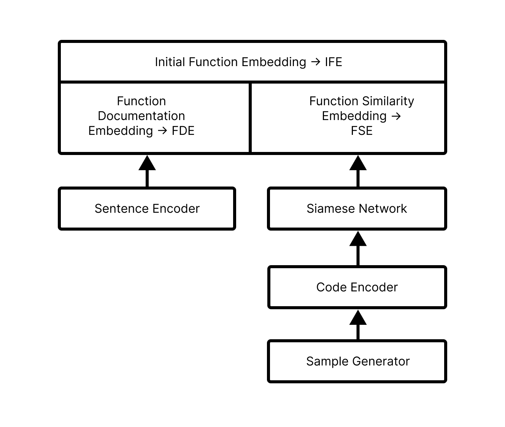

## function-representation

Represent function embeddings.

### Tasks

1. Represent function using vector embeddings

2. Find similarity between functions.

### Vector arithmetic

1. "binary_to_decimal" function will be 180 opposite of "decimal_to_binary" function
2. "mean" function == "average" function
3. "a_plus_b_whole_square" == "a_squared_plus_2ab_plus_b_squared" == "a_minus_b_whole_squared_plus_4ab"
4. "a_minus_b_whole_squared" == "a_squared_minus_2ab_plus_b_squared" == "a_plus_b_whole_squared_minus_4ab"
5. "a_cubed_minus_b_cubed" == "a_minus_b_whole_cubed_minus_3ab_times_a_minus_b" == "a_minus_b_times_a_squared_plus_ab_plus_b_squared"
6. "a_cubed_plus_b_cubed" == "a_plus_b_whole_cubed_minus_3ab_times_a_plus_b" == "a_plus_b_times_a_squared_minus_ab_plus_b_squared"
7. "x_plus_a_times_x_plus_b" == "x_squared_plus_a_plus_b_times_x_plus_ab"
8. "a_squared_plus_b_squared" == "a_plus_b_whole_square" + "negative_2ab" == "a_minus_b_whole_squared" + "positive_2ab"
9. "average" function should have some correlation with sum, len and division function.

### Pre-trained models

1. https://github.com/UKPLab/sentence-transformers/tree/master

2. https://github.com/microsoft/PyCodeGPT/tree/main (Not gonna work -> only provides logits)
3. https://github.com/microsoft/CodeBERT
   4. https://huggingface.co/microsoft/codebert-base
   5. https://huggingface.co/microsoft/graphcodebert-base (Going for this one)
      6. https://arxiv.org/abs/2009.08366
4. https://github.com/JetBrains-Research/astminer (Not gonna work -> inferior method)(Based on code2vec)

### Loss function

Need a better loss function than triplet loss function, which can accommodate all type of vector arithmetics.