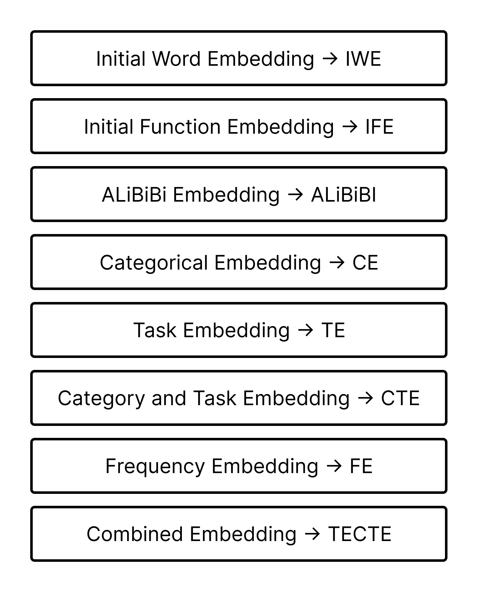

# Function Representation

Function Representation repository contain 92 functions, on whom we have trained our curious learner model.

## Table of Contents

- [Project Overview](#project-overview)
- [Folder Structure](#folder-structure)
- [License](#license)
- [Explored Models](#Explored-models)
- [Explored Embeddings](#explored-embeddings)

## Project Overview

Curious learner is a generative model which will aims to figure out proper function based on task that is asked 
using natural language. It not only find the proper function but also try to figure out the parameters of the function
from the give natural language prompt.

In this repository we have gather the following 98 mathematical function, which is used for training the curious 
learner model. 

1. addition(x: int, y: int)
2. subtraction(x: int, y: int)
3. multiplication(x: float, y: float)
4. division(x: float, y: float)
5. exponentiation(x: float, y: float)
6. square_root(x: float)
7. floor_division(x: int, y: int)
8. modulus(x: int, y: int)
9. logarithm(x: float, base: float)
10. sine(x: float)
11. cosine(x: float)
12. tangent(x: float)
13. arcsine(x: float)
14. arccosine(x: float)
15. arctangent(x: float)
16. hyperbolic_sine(x: float)
17. hyperbolic_cosine(x: float)
18. hyperbolic_tangent(x: float)
19. logarithm_base_10(x: float)
20. logarithm_base_2(x: float)
21. degrees_to_radians(x: float)
22. radians_to_degrees(x: float)
23. gcd(x: int, y: int)
24. lcm(x: int, y: int)
25. isqrt(x: int)
26. pow_mod(x: int, y: int, mod: int)
27. ceil(x: float)
28. floor(x: float)
29. round(x: float)
30. absolute_difference(x: float, y: float)
31. greatest_value(x: float, y: float)
32. smallest_value(x: float, y: float)
33. product(numbers: list)
34. factorial(x: int)
35. is_prime(x: int)
36. prime_factors(x: int)
37. is_perfect_square(x: int)
38. is_perfect_cube(x: int)
39. mean(numbers: list)
40. median(numbers: list)
41. relu(x: float)
42. ascending_sort(lst: list[int])
43. descending_sort(lst: list[int])
44. square_int(x: int)
45. square(x: float)
46. absolute(x: float)
47. power_of_ten(x: float)
48. cube(x: float)
49. cube_root(x: float)
50. is_even(x: int)
51. is_odd(x: int)
52. max_value(lst: list[int])
53. min_value(lst: list[int])
54. nth_root(x: float, n: int)
55. geometric_mean(lst: list[float])
56. is_power_of_two(x: int)
57. binary_to_decimal(binary)
58. decimal_to_binary(decimal)
59. is_palindrome(x: str)
60. sum_of_digits(x: int)
61. hypotenuse(a: float, b: float)
62. circle_area(radius: float)
63. permutation(n: int, r: int)
64. combination(n: int, r: int)
65. invert_number(number: float)
66. float_to_int(value: float)
67. int_to_float(value: int)
68. geometric_series_sum(a: float, r: float, n: int)
69. sigmoid(x: float)
70. cosine_similarity(vector1: list, vector2: list)
71. euler_totient(n: int)
72. l1_norm(vector: list)
73. l2_norm(vector: list)
74. average(numbers: list)
75. sum(numbers: list)
76. length(numbers: list)
77. check_same_string(str1: str, str2: str)
78. reverse_string(input_str: str)
79. get_pi()
80. get_e()
81. calculate_dot_product(vector1: list, vector2: list)
82. a_plus_b_whole_square(a: int, b: int)
83. a_squared_plus_2ab_plus_b_squared(a: int, b: int)
84. a_minus_b_whole_squared_plus_4ab(a: int, b: int)
85. a_minus_b_whole_squared(a: int, b: int)
86. a_squared_minus_2ab_plus_b_squared(a: int, b: int)
87. a_plus_b_whole_squared_minus_4ab(a: int, b: int)
88. a_squared_plus_b_squared(a: int, b: int)
89. negative_2ab(a: int, b: int)
90. positive_2ab(a: int, b: int)
91. x_plus_a_times_x_plus_b(x: int, a: int, b: int)
92. x_squared_plus_a_plus_b_times_x_plus_ab(x: int, a: int, b: int)
93. a_cubed_plus_b_cubed(a: int, b: int)
94. a_plus_b_whole_cubed_minus_3ab_times_a_plus_b(a: int, b: int)
95. a_plus_b_times_a_squared_minus_ab_plus_b_squared(a: int, b: int)
96. a_cubed_minus_b_cubed(a: int, b: int)
97. a_minus_b_whole_cubed_plus_3ab_times_a_minus_b(a: int, b: int)
98. a_minus_b_times_a_squared_plus_ab_plus_b_squared(a: int, b: int)

## Folder Structure

Briefly describing the purpose of each major folder in your project.

- `src` contains the source code of your project.
  - `math_functions.py` is the class which contain all the 98 functions.
  - `functions_manager.py` is a Python file which hold all utility method related to function string manipulation.
  - `code_embeddings.py` is this file we used [`"microsoft/graphcodebert-base"` model](https://huggingface.co/microsoft/graphcodebert-base) for converting the function string 
  into function embedding. [graphcodebert-base Paper](https://arxiv.org/abs/2009.08366)
  - `sentence_embedding.py` here we have used [`"all-mpnet-base-v2"` model](https://github.com/UKPLab/sentence-transformers/tree/master) for converting sentence into embeddings.
- `README.md` is the main documentation file.

Please ignore the siamese.ipynb, siamese_network.py, sn_dataloader.py, sn_dataset.py and other notebooks
Initially we tried to use a siamese network for creating a relationship between function embeddings, but that need
further exploration.

## License
This repository is licensed under the GNU Affero General Public License - see the [LICENSE.md](LICENSE) file for details.

## Explored Models

1. [Sentence Encoder](https://github.com/UKPLab/sentence-transformers/tree/master)
2. [Py Code GPT](https://github.com/microsoft/PyCodeGPT/tree/main)
3. [CodeBERT Base](https://huggingface.co/microsoft/codebert-base)
4. [GrapCodeBert-Base](https://huggingface.co/microsoft/graphcodebert-base)
5. [JetBrains Astminer](https://github.com/JetBrains-Research/astminer)

## Explored Embeddings

We have 7 different type of embeddings, let’s describe them in brief one by one.

1. Initial Word Embedding(IWE): We will not use our own tokenizer, Rather we will
use `“all-mpnet-base-v2”` pre-trained model for the words provided by input/output
parser. IWE is a [1*768] tensor for each word.

2. Function Token embeddings(FTE): We will not use our own tokenizer here as
well, Rather we will use `“microsoft/graphcodebert-base”` pre-trained model for
getting the Function token embeddings(FTE).

3. ALiBiBi Embedding(PE): Attention with linear bidirectional bias, is a way to embed
positional information in the attention layer, it helps in making the attention span 
longer, which meaning longer decoding length. [Paper: Train Short, Test Long](https://arxiv.org/abs/2108.12409)

4. Categorical Embedding(CE): Category embedding will inject token type
information inside main embedding. It encodes category type, subtype and sub-subtype
inside an embedding.

5. Task Embedding(TE): It encodes the type of task in a embedding.

6. Frequency Embedding(FE): This is the fourier transformation of the summation
of Categorical embedding and Task embedding. This will be passed along
as a linked information(Tuple) with the main embedding.

7. Combined Embedding: Combining the Token embedding with Categorical and task embeddings
results in combined embedding.

